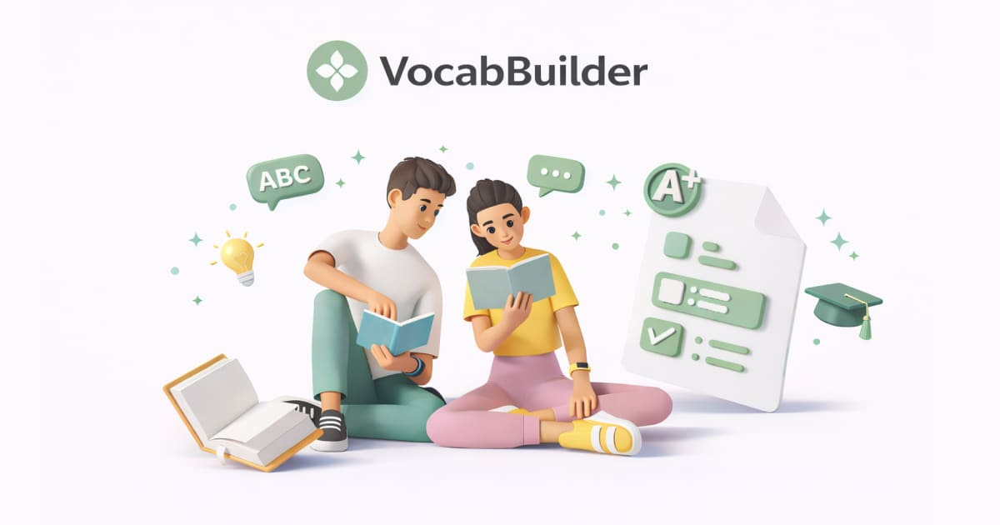
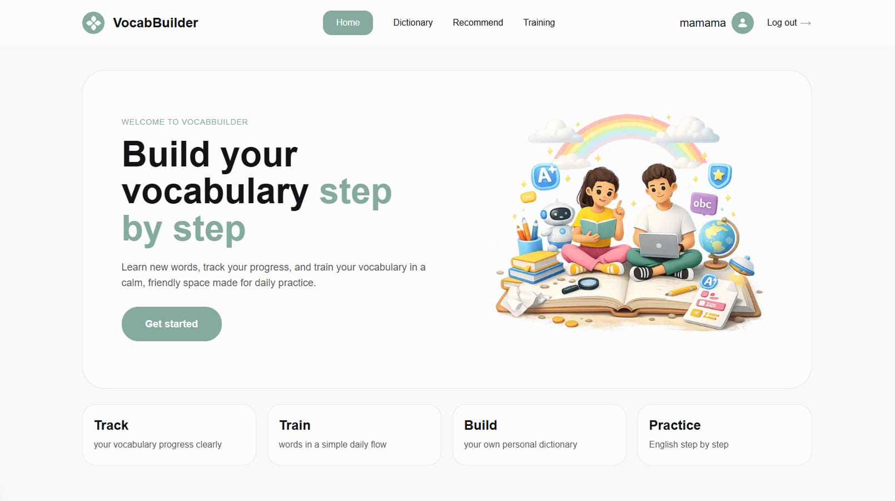
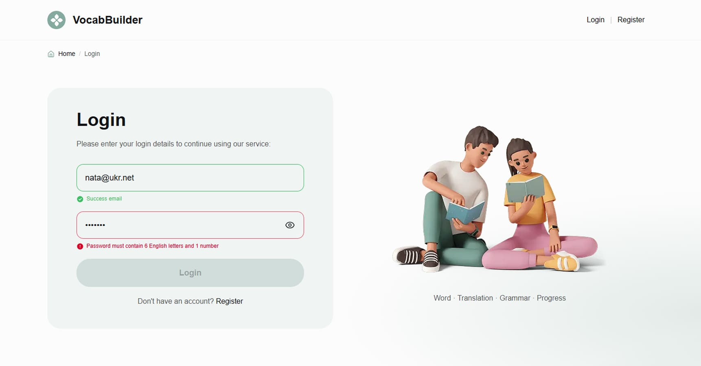
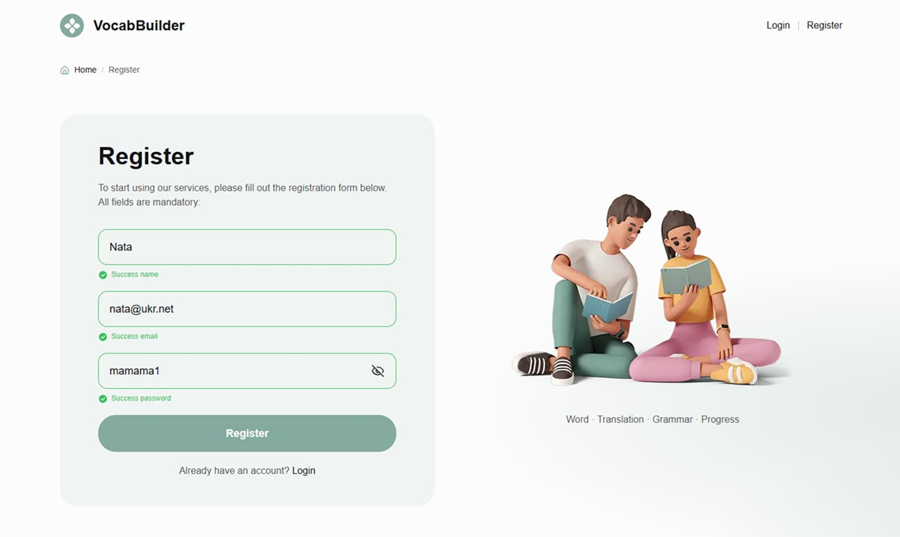
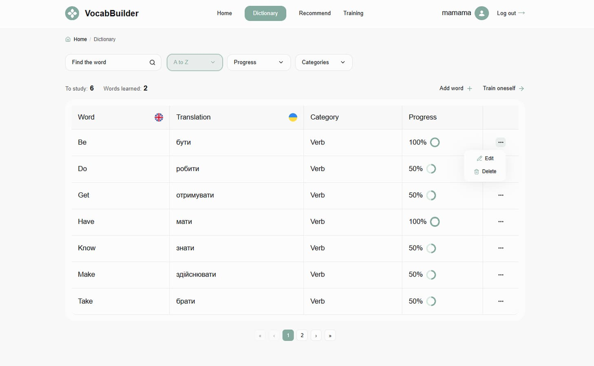
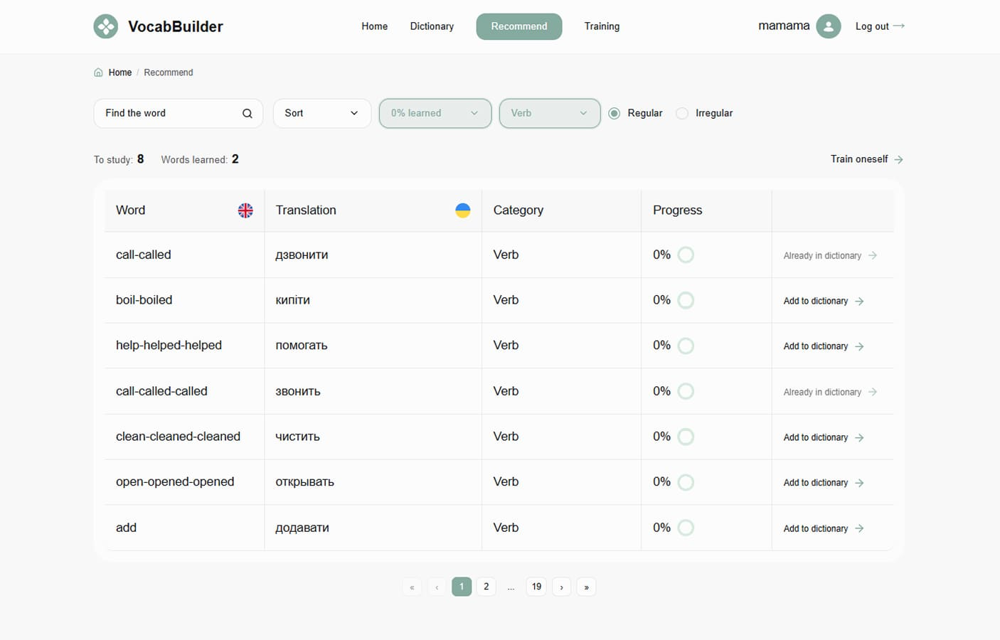
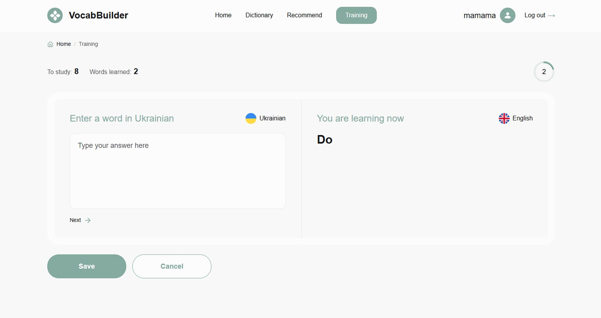
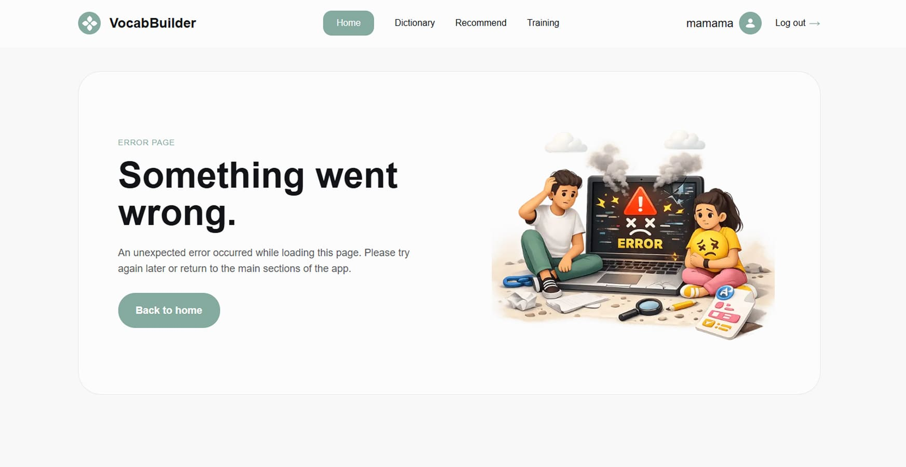
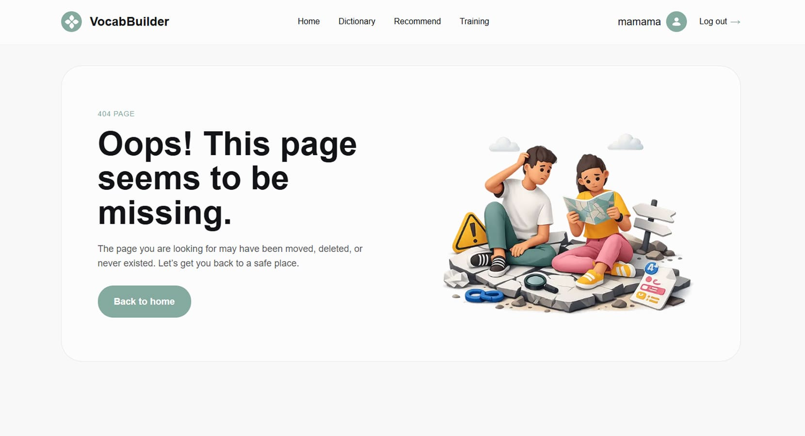

# VocabBuilder

> A modern vocabulary learning web application built with **Next.js**, **TypeScript**, and a custom backend API.



## Overview

**VocabBuilder** is a responsive full-stack web application designed for learning English vocabulary in a structured and interactive way.

The app allows users to:

- create an account and access a protected personal learning space
- build and manage a custom dictionary
- discover recommended words and add them to the dictionary
- track vocabulary progress
- complete training sessions with step-by-step translation tasks
- review final training results in a clean success flow

The project focuses on a polished user experience, reusable architecture, clear route structure, and practical integration with a real backend API.

---

## Live Demo

```txt
https://your-vocabbuilder-domain.vercel.app
```

---

## Screenshots

### Home page



### Login page



### Register page



### Dictionary page



### Recommend page



### Training page



### Error page



### 404 page



---

## Features

### Authentication and route protection

- registration with validation
- login with validation
- logout with session cleanup
- cookie-based authenticated flow
- protected private routes
- redirect protection for public-only auth pages

### Dictionary management

- browse personal vocabulary
- search words by keyword
- filter by category
- filter verbs by regular / irregular type
- sort words alphabetically
- add new words
- edit words
- delete words
- view vocabulary progress

### Recommended words

- browse recommended vocabulary
- apply filters and search
- add words directly to the personal dictionary
- reflect already-added words inside the recommended list

### Training flow

- fetch training tasks from the backend
- answer translation tasks step by step
- move between tasks with visible progress
- submit answers
- open a final results modal after completion
- handle empty-state training scenarios

### UX and interface

- responsive layout for mobile, tablet, and desktop
- offcanvas navigation for smaller screens
- reusable dashboard, table, pagination, and modal patterns
- loaders, breadcrumbs, toasts, and empty states
- custom illustrations for home, error, and not-found pages

---

## Tech Stack

### Frontend

- **Next.js 16**
- **React 19**
- **TypeScript**
- **CSS Modules**

### State and data

- **Zustand**
- **TanStack Query**

### Forms and validation

- **React Hook Form**
- **Yup**

### UI utilities

- **Lucide React**
- **clsx**
- **react-hot-toast**

### Backend integration

- custom backend API
- authenticated requests through Next.js route handlers
- cookie-based session support for protected pages

---

## Project Structure

```txt
app/
  api/
    auth/
    training/
    words/
  dictionary/
  login/
  recommend/
  register/
  training/
  error.tsx
  layout.tsx
  not-found.tsx
  page.tsx

components/
  auth/
  common/
  dashboard/
  header/
  modals/
  training/
  words/

hooks/
lib/
  api/
  auth/
  constants/
  forms/
  server/
  services/
  utils/
  validations/

providers/
public/
  og/
  readme/
store/
types/
```

---

## Main Pages

### Home

A landing page that introduces the product and guides users into the learning flow.

### Login / Register

Authentication pages with validation, password visibility toggle, toast notifications, and protected redirect logic.

### Dictionary

A private page for managing personal vocabulary through search, filtering, progress tracking, editing, and deleting.

### Recommend

A private page for discovering new vocabulary and adding it directly to the personal dictionary.

### Training

A private page for interactive practice with translation tasks, progress tracking, and final result feedback.

---

## API Overview

The frontend communicates with the backend through **Next.js API route handlers**, which proxy requests and help keep the client-side data flow clean and secure.

### Main API areas

- auth

  - register
  - login
  - current user
  - logout

- words

  - categories
  - own dictionary words
  - recommended words
  - create word
  - edit word
  - delete word
  - add recommended word to dictionary
  - statistics

- training
  - tasks
  - answers submission

---

## Environment Variables

Create a `.env.local` file in the project root.

```env
NEXT_PUBLIC_API_URL=https://vocab-builder-backend.p.goit.global/api
NEXT_PUBLIC_SITE_URL=https://your-domain.vercel.app
```

---

## Getting Started

### 1. Clone the repository

```bash
git clone <your-repository-url>
cd vocab-builder
```

### 2. Install dependencies

```bash
npm install
```

### 3. Add environment variables

Create a `.env.local` file and add the required variables.

### 4. Run the development server

```bash
npm run dev
```

### 5. Open the app

```txt
http://localhost:3000
```

---

## Available Scripts

```bash
npm run dev
npm run build
npm run start
npm run lint
```

---

## Highlights

What makes this project especially interesting:

- full vocabulary workflow from discovery to practice
- private user space with protected routes
- reusable UI architecture with shared tables, dashboards, modals, and forms
- semantic route-driven filters
- clean integration with a real backend API
- polished UI states for loading, empty results, success, error, and not-found pages

---

## Author

**Nataliia Skoropad**  
Frontend Developer / UX/UI Designer

---

## License

This project is created for educational and portfolio purposes.
